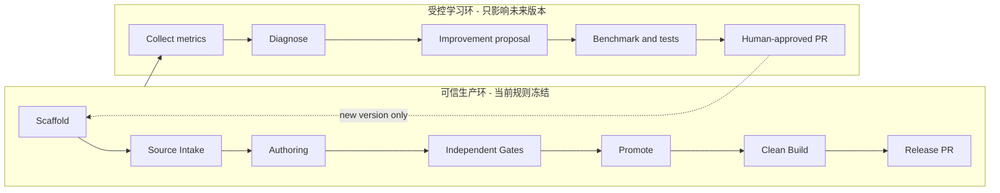

# CILS Exam Factory v2 设计规格

- 日期：2026-07-10
- 状态：设计已由用户逐节确认
- 当前范围：CILS A1、A2、B1、B2、C1；不含听力与口语
- 首个 v2 session：`2026-07-10`
- 实施策略：可信链优先，分阶段交付

## 1. 目标

把当前可运行的试卷生成仓库升级为可长期维护的“来源 → 命题 → 独立验证 → 仿真排版 → GitHub Pages → 受控自我改进”系统。

v2 必须同时满足：

1. 每份来源可追溯，改写边界清楚，不能用搜索片段拼接成未经证明的“原文”。
2. 题目、答案、解释与机器 key 由同一结构化模型生成，不能各自漂移。
3. 发布门禁验证真实内容、题数、分值、指令、答案、难度代理指标和最终渲染，不只检查文件存在或关键词。
4. 每个 PASS 都绑定同一组输入和输出哈希；审计后任何改动都会使 PASS 失效。
5. PDF 面向纸上考试，Pages 面向屏幕学习；两者共享内容但不强求相同视觉语言。
6. 每次运行可以提出改进 PR，但不能在运行中修改当前规则，也不能自动合并。
7. 已发布 session 永远不可原地修改；修订必须使用新的 `YYYY-MM-DD-rN` session。

## 2. 已确认的产品决策

用户确认以下选择：

- 视觉采用“双轨输出”：考试仿真 PDF + 现代学习型 Pages。
- 自我更新只生成经过测试的 PR，由人确认后合并。
- 实施采用“可信链优先”，先修发布证据和状态机，再升级来源、命题、卷面和网站。
- 生产环与学习环隔离；学习环只影响未来版本。
- `Paper Model` 是唯一内容事实源，Markdown 不再承担数据库职责。
- 同一 artifact set 依次通过六道门；最多定向修复两轮，仍失败则保留 draft。
- 一个 canonical `genpapers` skill、一个确定性生命周期 CLI、两类独立 PR。

## 3. 当前基线与主要缺口

### 3.1 已有能力

当前仓库已经具备：

- S0–S7 流程说明与 A1–C1 配置、模板和样卷分析。
- 隔离式 blind validation：候选人只读取复制到 `/tmp` 的 `paper.md`。
- `format_audit.py`、`paper_quality_audit.py`、`paper_status.py` 与 `build_site.py`。
- 15 份已发布练习卷和对应 HTML、Markdown、PDF。
- 当前六个脚本级 fixture tests 全部通过。

这些能力保留，但必须由 v2 契约重新约束。

### 3.2 发布阻断级缺口

1. `scripts/format_audit.py` 未实现 checklist 声明的大部分契约：不核对实际 item 数、points、durations、consegne、`answers.md` 完整性、范文字数或 glossario。
2. blind、format、quality 的 PASS 没有绑定文件哈希；审计后修改 `paper.md` 仍可能继续构建。
3. `quality:` 缺失会触发通用 legacy 绕过；新 manifest 也能伪装 legacy。
4. GitHub Pages workflow 只上传已提交的 `docs/`，不重新审计或构建。
5. 构建器不清理失效输出，published 降为 draft 后旧 URL 仍可能存在。
6. published 不可变性主要依赖提示词；写入脚本没有统一拒绝已发布 session。

### 3.3 长期维护缺口

- manifest 阶段由多个参与者手工追加，已出现时间顺序、stale reason 和 repair 记录漂移。
- `blind_validation.py reconcile` 在报告 fail 时仍返回 0，不适合自动化 fail-fast。
- quality depth 目前按题干关键词计数，容易把直接定位题误判为高阶题。
- `sources.md` 可能保存大段原始正文或用有限 fetch 片段重组，来源完整性与版权边界不稳定。
- PDF 缓存只看 Markdown mtime，忽略 CSS、renderer、manifest 和 Chrome 版本。
- `.agents`、`.codex`、`.claude` 多个入口重复，已有不存在的 companion 路径和大小写漂移。
- Pages 缺少质量与来源详情、答案主动揭示、完整无障碍 metadata 和干净构建闭包。

## 4. 样卷证据边界

本次对照的本地目录为：

`/Users/kendrickstein/Documents/🍝意大利语学习/CILS_Pavia`

它包含 2024 年 12 月的 A2 Integrazione、B1 Cittadinanza、B1 Standard、B2、C1、C2 六份题册/解答合并 PDF。

使用限制：

- 无 A1、无 A2 Standard，且只有单一场次，不能把观察结果硬编码成所有年份和 module 的永恒规则。
- `CILS_Pavia` 只是本地目录名，不能作为发布者或版权归属。
- 可以抽取题型、计数、指令模式、作答空间、分页和评分结构；不得复制完整题文、图片、官方 logo、条码、标签区或 GDPR 文本。
- 扫描倾斜、OCR 错误、模板残留不是应仿造的“官方风格”。

结构比较 rubric 固定为：

| 维度 | 权重 |
|---|---:|
| 题型与数量 | 25% |
| Instruction wording | 15% |
| 答题可用性 | 15% |
| 版式与打印 | 15% |
| 评分与答案 | 15% |
| 视觉真实性 | 5% |
| 来源、版权与隐私 | 10% |

以下任一项为硬失败：item/key 数量不一致、题目不可唯一作答、词数范围错误、评分总和错误、教师答案泄露进学生卷、缺失来源记录。

## 5. 总体架构

系统分为两个隔离闭环。

### 5.1 可信生产环

- session 开始时锁定 exam、level、module、variant、模板、skill 和 renderer 版本。
- 运行中规则冻结；只能修复本 session 的来源、题目或版式 artifact。
- 所有 stage 事件写入 append-only run ledger。
- 六道门全部针对同一 artifact set 通过后，`paperctl promote` 才能计算为 publishable。
- Release PR 只包含通过门禁的 level、审计报告和干净构建产物。

### 5.2 受控学习环

- 收集来源失败、低置信度、歧义 flag、repair rounds、答案分布、认知类型和渲染缺陷。
- 把失败归因到 source policy、exam config、template、item rule、auditor、renderer 或 skill。
- 生成最小改进提案和对应失败测试。
- 通过 mutation、golden、Pavia rubric、视觉回归和 skill forward test 后创建 Improvement PR。
- 只有人工合并后的新版本才可用于下一 session。

### 5.3 禁止的跨环行为

- 运行中修改当前 skill/config 后继续给同一 artifact 补签 PASS。
- 用改进后的 auditor 为旧 artifact 追认发布。
- 修改已发布 session；修订必须新建 `-rN`。
- 将 Improvement PR 混入 Paper Release PR。

## 6. 核心数据契约

### 6.1 Run Ledger

每个 session/level 保存 append-only JSONL 事件。每条事件至少包含：

- `schema_version`
- `run_id`
- `session`、`level`、`variant_profile`
- `stage`、`attempt`、`repair_round`
- UTC timestamp
- executor/model/prompt version
- input artifact hashes
- output artifact hashes
- result、issue IDs、fixed item IDs

`manifest.yaml` 是 ledger 的可读摘要，不是可自由编辑的状态源。

### 6.2 Source Record

每个来源记录：

- URL、publisher、author、published、accessed、slot、genre。
- HTTP/fetch 状态、retrieval method、content digest。
- rights/usage note、隐私处理、是否允许公开摘编。
- CEFR 证据：词汇、语法、句长、体裁与判断者。
- adaptation policy、删减/简化摘要、事实保持检查、rewrite 上限。
- 原始快照的本地缓存路径与 hash。

原始全文只存入 ignored work cache，不提交仓库，不进入 Pages。仓库保存元数据、hash、必要的有限证据和最终使用的适配文本。

候选来源必须有足够正文支持目标文本；搜索摘要或零散 fetch 句子不能被拼装为“真实原文”。

### 6.3 Paper Model

每个 level 使用结构化 `paper-model` 作为唯一内容事实源，至少包含：

- paper metadata：exam、level、module、variant、duration、scoring。
- adapted texts：正文、source ID、字数、adaptation hash。
- objective items：item ID、type、stem、options、answer、accepted variants。
- evidence：正确答案证据 span、每个 distractor 的错误理由。
- cognition：locate、integrate、infer、purpose/frame、pragmatics。
- writing tasks：任务、选题数、词数、评分维度、所需作答空间。
- answer notes：解释、中文提示、范文、可复用表达、glossary。

修改一道题只能修改 model；学生卷、教师版、机器 key 与 Pages 数据必须一起重建。

### 6.4 Artifact Set

artifact set hash 覆盖：

- paper model
- source records
- `exam.yaml`
- variant profile
- level template
- skill/prompt versions
- renderer code and styles

blind、contract、quality、difficulty 和 render reports 都记录相同 artifact set hash。任一输入变化会使旧报告失效。

### 6.5 Legacy Registry

现有 published session 不重写。迁移时建立显式 legacy registry，记录每个历史 level 的固定路径和文件 hashes。

- legacy 权限来自 registry 中的固定条目，不来自“manifest 缺少 quality 字段”。
- 历史文件 hash 漂移立即构建失败。
- 所有新 session 必须使用 schema v2，不存在通用 legacy fallback。

## 7. v2 流程与角色

保留用户熟悉的 S0–S7 名称，同时把每个阶段交给明确接口。

| 阶段 | 责任 | 输出 |
|---|---|---|
| S0 | `paperctl scaffold` 锁定配置并创建 ledger | manifest stub、run metadata |
| S1 | source-hunter 收集，source auditor 验证 | source records、私有 cache、coverage report |
| S2 | item-writer 写 paper model | structured texts/items/answers |
| S3 | blind-solver 只看学生卷 | blind answers、confidence、flags |
| S4 | adversarial reviewer + 定向修复 | ambiguity report、repair events |
| S5 | contract/difficulty/source audits | hash-bound gate reports |
| S6 | 双轨 renderer + visual/a11y audit | PDF、HTML、source/quality pages |
| S7 | promote、clean build、Release PR、Pages | publishable artifact closure |

### 7.1 隔离要求

- blind-solver 只收到隔离目录中的学生卷，不得看到 key、answers、sources、manifest、repo path 或 web。
- adversarial reviewer 不看 key，任务是寻找第二个合理答案、弱 distractor、外部知识依赖和 instruction 歧义。
- source fidelity reviewer 查看来源证据与适配文本，但不参与 item authoring。
- auditor 读取结构化 model 与配置；不从作者的自然语言总结中推断是否通过。

### 7.2 Repair 路由

- source failure → 换来源或降低改写目标；不能靠编造连接段修补。
- item failure → 只改失败 item 与证据，重建整个 artifact set，重新验证受影响 prova。
- difficulty failure → 调整认知目标、distractor 与答案分布，不能只增加关键词。
- render failure → 修改模板/CSS 后使全部 PDF 缓存失效并重建。
- 同类最多两轮；仍失败则 level 保持 draft，并记录稳定 failure taxonomy。

## 8. 六道发布门

### G0 Lifecycle

- schema v2。
- stage 顺序和 timestamp 单调。
- repair round 与 fixed item IDs 完整。
- published session 的所有写入被拒绝。

### G1 Source

- 来源字段、fetch 证据、rights note、CEFR 与 adaptation 信息完整。
- 原始正文足以支持最终文本；事实保持审核通过。
- 同 session 跨 level 去重，除非有显式理由。
- raw cache 和 `reference/` 不进入 git 或 Pages artifact。

### G2 Contract

- front matter、section/prova 顺序、duration、points 与 `exam.yaml` 一致。
- item 数、选项数、distractor 数、原子 item IDs 和 scoring units 正确。
- consegna 与 variant template 标准化后精确一致。
- student/teacher separation、答案、解释、范文、词数、glossary 完整。
- 排序题区分片段数、连接数和实际计分单元。

### G3 Blind + Adversarial

- blind agreement 100%。
- 零 ambiguity/unanswerable flags。
- adversarial reviewer 未发现第二个合理答案、答案泄漏或外部知识依赖。
- writing task 自包含，词数和选题规则明确。

### G4 Difficulty and Item Quality

- `exam.yaml` 的 level/variant profile 声明认知类型目标，不用题干关键词替代真实认知分析。
- B2/C1 reading P1 至少包含 locate 之外的 integrate、infer 和 purpose/frame 项；精确配额由 profile 配置。
- 检查答案位置分布、选项长度和语法平行、重复题、绝对词线索和跨题泄漏。
- “difficulty target” 只是基于语言与认知特征的校准代理；没有真实考生数据时不得声称具有心理测量学难度。

### G5 Render and Release

- A4、页码、level/session 页脚、无裁切、无表格断裂、无意外空白页。
- 写作横线、字符格、OMR 圈和改写空间容量与题型/最大词数匹配。
- 允许的写作留白页必须显式标记。
- Pages 通过 accessibility、responsive、link 和 artifact closure 检查。
- CI 从空目录重建；部署目录与 publishable manifests 精确相等。

## 9. 测试策略

### 9.1 Contract 与 mutation tests

Checklist 每一行必须有一个只破坏该规则的失败样例，例如：

- 删除一道题或一个 key。
- 修改 consegna 一词。
- 篡改分值或词数范围。
- 删除 source 字段。
- 审计后修改 `paper.md` 一个字符。
- 从 published 改回 draft 后验证旧输出被删除。
- 污染部署目录后验证 clean build 不携带污染文件。

### 9.2 Golden fixtures

- 每个 level/variant 至少一份最小、可读的 passing fixture。
- golden fixture 必须包含真实数量结构，不能用“只有一个 key entry”的空壳替代完整契约。
- Pavia 样卷只形成结构 benchmark metadata，不存完整题文。

### 9.3 Independent evaluation tests

- blind parser 覆盖多种合法输出、extra answer、flags、sequence atomicity 与 fail exit code。
- adversarial fixtures 包含双答案、同义 options、外部知识和薄弱 distractor。
- source fixtures 包含 paywall stub、搜索摘要、正文不足、事实漂移和跨 level 重复。

### 9.4 Render tests

- PDF：A4、非空、字体嵌入、page count、页码/总页数、关键文字可提取。
- 页面 PNG：封面、正文、选择题、排序题、结构改写、写作页、答题卡、末页。
- 视觉规则：裁切、溢出、孤行、表格跨页、无意空白、重复免责声明。
- Pages：375/768/1280 px 无横向溢出，交互目标至少 44×44 px，AA contrast，正确 `lang` 和 focus state。

### 9.5 Skill tests

更新 canonical skill 必须遵守 skill TDD：

1. 使用旧 skill 运行至少三个压力场景并记录失败基线。
2. 最小修改 skill/资源。
3. 用相同场景前向测试，证明能找到 canonical CLI、保持 blind isolation、正确停在 draft/PR gate。
4. 验证 `.agents`、`.codex`、`.claude` 所有本地引用在大小写敏感临时目录中存在。

## 10. 双轨输出

### 10.1 打印/PDF

每个 level 稳定输出：

- `exam-booklet.pdf`：学生题册。
- `answer-sheet.pdf`：独立答题卡。
- `teacher-guide.pdf`：答案、证据、中文提示、范文和 glossary。

设计原则：

- official-inspired，不复制官方 logo、条码、标签区或商标化装饰。
- 黑白高对比、紧凑 instruction、稳定页码与 footer。
- 阅读文本与题目根据体裁和长度决定是否分页，不机械“一题一页”。
- 写作和句法改写提供可真实作答的横线/字符格。
- scoring 说明集中呈现，不在不应显示分值的 B2/C1 item 页泄漏。

### 10.2 GitHub Pages

信息架构：

1. 首页：最新 session、level filters、历史归档。
2. Session 页：五个 level 的状态和质量摘要。
3. Level 页：打开 HTML、下载三类 PDF、查看来源与质量。
4. Paper HTML：无障碍阅读版。
5. Answers：主动揭示，避免误点泄题。
6. Sources/Quality：publisher、title、URL、accessed、adaptation note 与 gate badges；不公开 raw text。

第一期不实现账号、云端进度、在线交卷、在线自动评分或作文自动评分。

## 11. Skill 与 CLI

### 11.1 Canonical skill

权威入口为 tracked `.agents/skills/genpapers/`。

- description 覆盖 `genpapers`、`Make Paper`、`生成试卷`、`出题`。
- SKILL.md 只保留判断、角色派发、异常解释和 CLI 使用原则。
- 详细 schema、rubric 与命令帮助放入 references 或 `paperctl --help`。
- 不硬编码 home cache、companion 版本或不存在的 `.Codex` 路径。

`.codex/skills/make-paper`、`.claude/skills/genpapers` 和 `.claude/commands/genpapers` 变为薄 wrapper，只指向 canonical skill 和 `factory/PIPELINE.md`。

### 11.2 `paperctl`

首版位于 `scripts/paperctl.py`，提供：

- `scaffold`
- `record-stage`
- `audit`
- `promote`
- `status`
- `build`
- `learn`

只有 `paperctl` 可以写 lifecycle state、计算 publishable 状态或生成发布 artifact。CLI 发现 published session 时默认拒绝写入。

## 12. PR、CI 与发布

### 12.1 Paper Release PR

- 分支：`codex/papers-<session>`。
- 只包含该 session 的 publishable levels、reports 和构建源。
- draft levels 明确列在 PR 报告中，但不伪装完成。
- 不修改 skill、auditor、template 或 factory policy。

### 12.2 Factory Improvement PR

- 分支：`codex/factory-improvements-<session>`。
- 每项变更引用具体 failure IDs、metrics 和 RED baseline。
- skill、config、code 或 renderer 改动必须各自带测试。
- 不修改本 session 已发布 artifact。

### 12.3 CI

PR 和 main 上运行：

1. unit、fixture、mutation、skill entrypoint tests。
2. schema/ledger/hash validation。
3. 对所有 publishable candidates 重新运行 gates。
4. 从空目录构建站点与 PDF。
5. 检查 `site paper dirs == publishable manifest dirs`。
6. 上传当前 job artifact 到 GitHub Pages。

CI 不直接信任 committed `docs/`。迁移期可以继续生成 `docs/` 供本地预览，但 Pages 部署必须使用 job 的 clean build 输出；稳定后停止把 `docs/` 作为发布权威。

## 13. 可观测性与自我改进报告

每次 session 输出机器可读 metrics 和人类报告，至少包含：

- source candidate 接受/拒绝率及原因。
- 每 level/slot 的来源新鲜度、体裁、CEFR 和 rewrite level。
- 初次 blind agreement、最终 agreement、flags、repair rounds。
- item cognitive distribution、answer-position distribution、distractor issues。
- contract/source/difficulty/render failure IDs。
- PDF page counts、visual issues、a11y issues。
- publishable/draft levels 与原因。
- Improvement PR 候选及其证据。

没有足够证据时，学习环可以输出“无改进 PR”，不能为了体现自我更新而强行修改规则。

## 14. 分阶段实施边界

这是一份长期程序设计，不用一个大爆炸式 implementation plan 完成。每个 phase 单独写计划、测试、review 和 PR。

### Phase 1：Trust Foundation

- schema v2、run ledger、artifact hashes、legacy registry。
- `paperctl` lifecycle/promote/status。
- shared normalized parser 与完整 contract mutation tests。
- reconcile fail exit code、published write guard。
- clean/atomic build、CI 重建与 artifact closure。
- canonical skill 和薄 wrappers，完成 skill RED/GREEN forward tests。

完成条件：审计后改一字符必失败；v2 删除 quality 必失败；published 写入被拒绝；Pages 只部署 clean build。

### Phase 2：Source and Paper Model

- source record、private raw cache、rights/CEFR/adaptation checks。
- structured paper model、统一 render inputs、item evidence 与 cognition tags。
- dual blind/adversarial validation、真实 item quality checks。

完成条件：paper/answers/key 不能独立漂移；来源不足或双答案 fixture 必失败。

### Phase 3：Dual Renderer and Pages

- exam booklet、answer sheet、teacher guide。
- Pavia-derived print rubric、PDF visual regression。
- 新 Pages 信息架构、quality/source pages、accessibility 与 SEO。

完成条件：所有 representative pages 通过 render gate；Pages a11y/closure checks 通过。

### Phase 4：First Full v2 Session

- 运行 `2026-07-10` A1–C1 全流程。
- 创建 Paper Release PR。
- 生成 session retrospective；有证据才创建独立 Factory Improvement PR。

完成条件：每个发布 level 同一 hash 六门全 PASS；draft level 原因完整；PR 合并后 Pages 正确部署。

## 15. 验收标准

| ID | 验收条件 |
|---|---|
| R1 | 所有新 manifest 使用 schema v2；legacy 只能来自固定 registry。 |
| R2 | 任一审计后 artifact 变更都会使 promote/build 失败。 |
| R3 | Checklist 每条规则都有 mutation test，format PASS 能证明真实契约。 |
| R4 | paper、answers、key、Pages 数据从同一 paper model 构建。 |
| R5 | 每个 source 有 fetch/hash/rights/CEFR/adaptation 证据，raw text 不发布。 |
| R6 | blind 与 adversarial validation 独立，零 flags 才能晋级。 |
| R7 | PDF 有真实答题卡、页码、足够作答空间且无裁切/意外空白。 |
| R8 | Pages 显示质量与来源摘要，答案主动揭示，并通过 a11y/响应式检查。 |
| R9 | Release PR 与 Improvement PR 分离；无自动合并。 |
| R10 | `2026-07-10` A1–C1 完成 v2 运行，只有全 PASS level 可发布。 |

## 16. 非目标

- 不生成听力或口语。
- 不在本轮增加 C2。
- 不复制、重新发布或训练于完整官方样卷内容。
- 不实现用户账号、云端进度、在线考试、作文自动评分或心理测量学难度估计。
- 不为宣称“自我更新”而自动合并、自动修改 main 或重写历史发布物。
